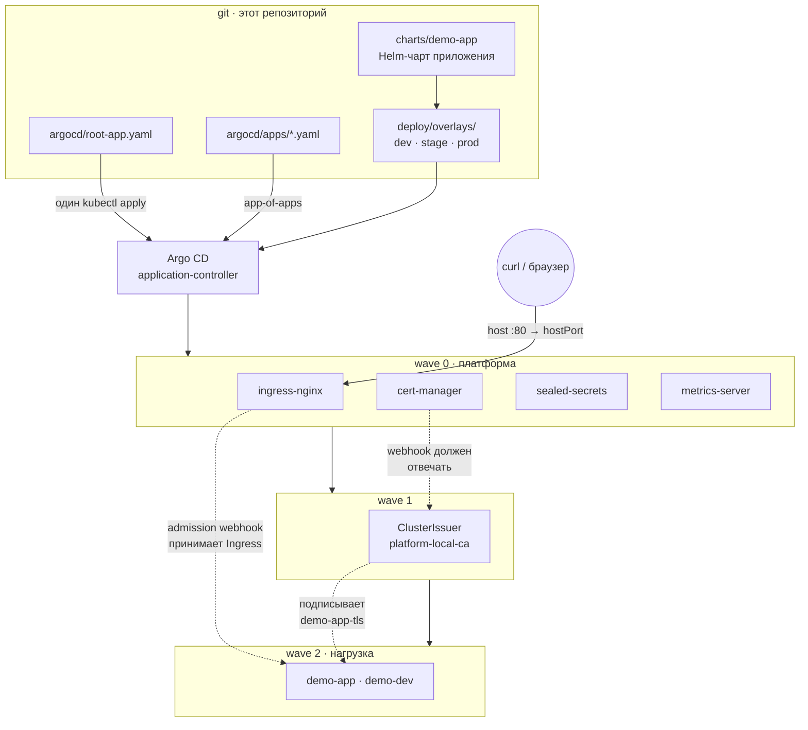

# k8s-platform-gitops

Референсная GitOps-платформа на Argo CD, которая поднимается локально одной командой:
kind-кластер на три узла, четыре платформенных компонента и демо-нагрузка — всё через
app-of-apps, без единого `kubectl apply` после бутстрапа.

---

## Задача

Кластер живёт долго, а способов положить в него манифест — много, и каждый плохо
масштабируется:

**`kubectl apply` руками.** Работает ровно до момента, когда в команде появляется
второй человек. Состояние кластера перестаёт быть выводимым из чего-либо: чтобы
понять, почему в проде три реплики вместо двух, приходится читать историю Slack.
Откат — это «примени старый файл, если он у кого-то остался».

**CI пушит в кластер (`kubectl apply` из пайплайна).** Уже лучше: есть коммит и
есть лог. Но платит за это безопасностью и наблюдаемостью:

- у раннера должны быть креды на кластер — постоянные, широкие и лежащие в
  секретах CI. Компрометация пайплайна = компрометация прода;
- пайплайн знает только про свой прогон. Если кто-то поправил Deployment руками,
  CI об этом не узнает до следующего мержа, а после мержа молча затрёт — или не
  затрёт, если правка была в поле, которого нет в манифесте;
- «выкатилось» означает «apply вернул 0», а не «поды в Ready».

**GitOps (pull-модель).** Контроллер внутри кластера сам ходит в git и приводит
состояние к описанному. Отсюда три свойства, которых нет у push-модели:

1. Наружу не выдаются доступы к кластеру — Argo CD ходит в git, а не наоборот.
2. Дрейф детектируется постоянно, а не в момент деплоя: ручная правка либо видна
   как `OutOfSync`, либо откатывается `selfHeal` на следующем цикле.
3. Откат — это `git revert`, а не поиск артефакта.

Этот репозиторий — не туториал по Argo CD, а рабочий скелет платформы: с
разделением платформа/нагрузка по проектам, с волнами синхронизации там, где есть
реальные зависимости, и с CI, который рендерит и валидирует всё, что попадёт в
кластер.

---

## Архитектура



Единственная императивная операция — `kubectl apply -f argocd/root-app.yaml` в
`scripts/bootstrap.sh`. Дальше root-Application читает каталог `argocd/apps/`, и
каждый файл в нём становится дочерним Application: либо upstream-чарт на
зафиксированной версии, либо путь внутри этого же репозитория.

Подробнее: [`docs/architecture.md`](docs/architecture.md) — схема узлов и конвейер
рендеринга, [`docs/sync.md`](docs/sync.md) — как именно работает синхронизация,
волны и что считается «здоровым».

---

## Решения и компромиссы

### app-of-apps, а не ApplicationSet

ApplicationSet сильнее там, где Application'ы однотипны и их много: пятнадцать
неймспейсов одного сервиса, десять кластеров, per-PR preview-окружения. Генератор
превращает список в манифесты, и это ровно то, для чего он сделан.

Здесь набор компонентов разнородный: у cert-manager нужен `ServerSideApply`
из-за размера CRD, у ingress-nginx — `hostPort` и `nodeSelector` под kind, у
metrics-server — `--kubelet-insecure-tls`, у sealed-secrets — свой неймспейс.
Общего между ними — только то, что это Application. Шаблон генератора, в котором
половина полей приходит из `matrix`-элементов, читается хуже, чем семь отдельных
файлов, и диффится хуже: правка одного компонента в ApplicationSet — это правка
файла, который описывает все семь.

Второй аргумент — радиус поражения. Опечатка в шаблоне ApplicationSet с
`prune: true` пересобирает все дочерние Application разом. Опечатка в
`argocd/apps/metrics-server.yaml` ломает metrics-server.

Где ApplicationSet тут действительно был бы к месту — это раскатка одного и того
же `deploy/overlays/*` на dev/stage/prod: три Application, отличающиеся путём и
неймспейсом, это ровно та однотипность, под которую он сделан. В этом репозитории
на kind поднимается только dev (три копии одних и тех же подов на одних и тех же
узлах ничего не проверяют), поэтому генератор ради одного элемента не нужен.
Точка расширения обозначена: `argocd/apps/demo-app.yaml`.

### Helm для приложения, Kustomize для окружений — оба, а не один

Это два разных вопроса, и попытка закрыть оба одним инструментом даёт худший
результат, чем связка.

**Что делает Helm.** Чарт `charts/demo-app` описывает инварианты приложения:
probes, `securityContext`, PDB, HPA, NetworkPolicy, связь Service ↔ Ingress ↔
targetPort. Здесь нужна логика: `replicas` не должно рендериться, когда включён
HPA; PDB не должен рендериться, когда он выключен; чарт должен упасть на рендере,
если `minAvailable` больше числа реплик (см. `templates/pdb.yaml`) — потому что
такой PDB навсегда блокирует `kubectl drain`, и узнавать об этом в три часа ночи
не хочется. Kustomize так не умеет и не должен: он не язык.

**Что делает Kustomize.** Оверлеи описывают разницу между окружениями. И вот
здесь Helm проигрывает: `values-prod.yaml` — это не diff, это полный набор
значений, из которого нужно глазами вычитать `values-stage.yaml`, чтобы понять,
чем прод отличается. `deploy/overlays/prod/hpa.yaml` — это восемь строк, в
которых написано ровно то, чем прод отличается, и ничего больше.

**Как они соединены.** `deploy/base` не копирует чарт, а инфлейтит его:

```yaml
helmGlobals:
  chartHome: ../../charts
helmCharts:
  - name: demo-app
    valuesFile: chart-values.yaml
```

Оверлеи патчат уже отрендеренный вывод. Поле живёт ровно в одном месте: либо в
чарте (если оно нужно приложению всегда), либо в оверлее (если оно различается).
Цена решения честная: Kustomize должен запускаться с `--enable-helm`, что
включено в `argocd-cm` (`kustomize.buildOptions`) и передаётся явно в
`scripts/validate.sh`. Забыть про этот флаг — значит получить `must specify
--enable-helm` в repo-server, и это ровно та связанность, которую здесь принимают
осознанно.

Альтернатива «чарт + `values-{dev,stage,prod}.yaml`, никакого Kustomize» рабочая
и проще в настройке. Отказался из-за читаемости диффа между окружениями: именно
он чаще всего нужен на ревью.

### Секреты: sealed-secrets, не external-secrets и не SOPS

| | Что нужно снаружи | Кто может расшифровать | Основной минус |
|---|---|---|---|
| **sealed-secrets** | ничего | контроллер в кластере | ключ живёт только в кластере — потеря неймспейса = потеря всех секретов |
| **external-secrets** | Vault / AWS SM / GCP SM | внешнее хранилище | нужен и оплачивается сам провайдер секретов |
| **SOPS + age/KMS** | ключ у каждого, кто редактирует | все держатели ключа | ротация ключа = переподпись всех файлов, git-мержи конфликтуют бинарно |

Выбор продиктован границей задачи: это самодостаточный локальный стенд. Внешнего
хранилища нет и появиться неоткуда, поэтому external-secrets отпадает не по
качеству, а по применимости — на реальном кластере с уже развёрнутым Vault я бы
взял именно его, потому что там ротация и аудит доступа уже решены.

SOPS проигрывает по операционке: секрет в git зашифрован симметрично относительно
всех держателей ключа, и «отозвать доступ у ушедшего разработчика» означает
переподписать весь репозиторий. У sealed-secrets приватная половина не покидает
кластер вообще: шифрование — клиентская операция публичным ключом, расшифровка —
только контроллером.

Обратная сторона названа прямо, а не спрятана: снести неймспейс `sealed-secrets`
— значит потерять возможность расшифровать всё, что уже закоммичено. Процедура
бэкапа ключей описана в [`docs/sync.md`](docs/sync.md).

Своих `SealedSecret` в репозитории нет: демо-нагрузке нечего хранить, а
закоммитить зашифрованную пустышку ради демонстрации — это как раз то, что
отличает витрину от рабочего кода. Контроллер стоит как готовая точка входа.

### kind, не k3d

k3d стартует быстрее (k3s против полного kubeadm) и ест меньше памяти. Взял kind
по трём причинам:

1. **Совпадение с прод-окружением.** kind поднимает апстримный Kubernetes через
   kubeadm. k3s — это дистрибутив со своими решениями: Traefik вместо
   ingress-nginx по умолчанию, servicelb, отсутствующие по умолчанию компоненты.
   Их можно отключить флагами, но каждое отличие — это разница между «работает у
   меня» и «работает в проде».
2. **Версия ноды пинится дайджестом.** `kindest/node:v1.33.4@sha256:...` — узел
   ровно той версии, под которую проверялись схемы в CI (`kubeconform
   -kubernetes-version 1.33.4`).
3. **`extraPortMappings` — это обычный проброс портов Docker.** ingress-nginx
   слушает `hostPort` на control-plane-узле, `localhost:80` попадает в кластер
   без LoadBalancer, `localtest.me` резолвит любой поддомен в 127.0.0.1 — и
   `curl http://demo.dev.localtest.me` работает без правки `/etc/hosts`.

Плата — заметно более долгий холодный старт: kubeadm поднимает полноценный
control plane там, где k3s стартует одним бинарём. Для стенда, который создают
раз в день и держат часами, это приемлемо.

### cert-manager с самоподписанным CA, а не ACME и не «без TLS»

Локально ACME недоступен физически: Let's Encrypt должен достучаться до хоста
для HTTP-01, а `demo.dev.localtest.me` смотрит в 127.0.0.1. DNS-01 требует
реального домена и токена провайдера — не то, что кладут в демо-репозиторий.

Совсем без TLS было бы проще, но тогда манифесты прода отличались бы от того, что
проверяется локально, именно в том месте, где ошибаются: аннотация
`cert-manager.io/cluster-issuer`, блок `spec.tls`, имя секрета. Так проверяется
весь путь выпуска: Ingress → Certificate → CertificateRequest → Order → Secret.

Схема из трёх объектов, а не один `selfSigned` issuer:

```
ClusterIssuer selfsigned-bootstrap  →  Certificate platform-local-ca (isCA)
                                              ↓
                                    ClusterIssuer platform-local-ca (ca:)
                                              ↓
                                    сертификаты всех сервисов
```

Разница практическая: с `selfSigned`-издателем у каждого сервиса свой
недоверенный сертификат, и в браузере нужно кликать через предупреждение для
каждого хоста. С локальным CA достаточно один раз добавить корневой сертификат в
доверенные — дальше все сервисы кластера валидны. Переезд на ACME — это замена
блока `ca:` на `acme:` в одном файле; аннотации на Ingress не меняются.

### Волны синхронизации там, где есть настоящая зависимость

Волна — это дорогая конструкция: она сериализует то, что могло бы примениться
параллельно, и её легко превратить в «расставим всем номера на всякий случай».
Здесь волны стоят в четырёх местах, и у каждой есть отказ, который она чинит:

| Волна | Что | Что сломается без неё |
|---|---|---|
| `-10` | AppProjects | Application ссылается на проект по имени; несуществующий проект делает Application невалидным |
| `0` | cert-manager, ingress-nginx, sealed-secrets, metrics-server | ничего — зависимостей между ними нет, ставятся параллельно |
| `1` | ClusterIssuer | validating webhook cert-manager ещё не отвечает, `ClusterIssuer` отклоняется |
| `2` | demo-app | admission webhook ingress-nginx отклоняет `Ingress`, а `Certificate` не на чем выпустить |

Именно из-за волны 1 cert-manager и его issuer — два разных Application. Внутри
одного они попали бы в один проход: CRD, контроллер и `ClusterIssuer`
применились бы одновременно, и issuer упал бы на вебхуке, который ещё
поднимается. Граница между Application — это то, что позволяет сказать «дождись,
пока cert-manager станет Healthy».

Ретраи при этом не заменяют волны, а страхуют их: `retry.backoff` вытягивает
случай, когда зависимость опоздала на пару секунд, но не случай, когда порядок
принципиально неверен.

Дополнительный эффект — диагностика: в `make status` компонент, ждущий свою
волну, стоит в `OutOfSync`/`Progressing`, а не падает с ошибкой вебхука, которую
надо вычитывать из логов repo-server.

### AppProject: платформа и нагрузка разведены

Два проекта вместо `default`. `platform` разрешает cluster-scoped ресурсы (CRD,
ClusterRole, ClusterIssuer — без них компоненты не встанут) и ограничивает список
репозиториев-источников. `workloads` не разрешает ничего, кроме `Namespace`, и
дополнительно запрещает `Role`, `RoleBinding` и `ResourceQuota` в
`namespaceResourceBlacklist`.

Смысл в том, что PR в `deploy/overlays/prod`, который вместе с Deployment
добавляет ClusterRoleBinding, должен упасть на синхронизации, а не молча
расшириться в правах. Это не защита от злоумышленника с доступом к репозиторию —
это защита от копипасты чужого манифеста.

### Конфигурация приложения — в переменных пода, не в ConfigMap

Выглядит как шаг назад: ConfigMap для того и нужен. Но ConfigMap, подключённый
через `envFrom`, меняется под работающими подами и рестарта не вызывает —
изменение конфигурации доезжает до приложения в момент следующего случайного
пересоздания пода. Обычное лечение — аннотация с хешем ConfigMap в pod-шаблоне.
Здесь оно не работает: хеш считается при рендере чарта, а оверлей патчит
ConfigMap уже после, и аннотация остаётся от старого содержимого.

Переменные прямо в контейнере решают это без обвязки: патч оверлея меняет
pod-шаблон, Kubernetes сам делает rolling update. Компромисс — конфигурация не
переиспользуется несколькими Deployment, чего здесь и не требуется.

### Лимиты: память — да, CPU — нет

`requests` заданы для обоих ресурсов, `limits` — только для памяти.

CPU-лимит в Kubernetes реализован через CFS quota: под с лимитом 100m получает
10 мс на 100 мс периода и **троттлится**, даже когда узел простаивает. Хвост
латентности растёт на ровном месте. При этом справедливость уже обеспечена
`requests`: под конкуренцию CPU делится пропорционально запросам.

Память ведёт себя иначе — её нельзя одолжить и вернуть. Под без лимита при утечке
выдавливает соседей и приводит к OOM на уровне узла, поэтому лимит на память
обязателен.

### Прочие решения, короче

- **Образ по дайджесту.** `ealen/echo-server` пинится
  `sha256:006b92e1...`; тег `0.9.2` оставлен рядом как читаемая метка. Перезалитый
  апстримом тег не может незаметно поменять то, что запущено.
- **`replicas` и HPA не воюют.** Чарт не рендерит `spec.replicas`, когда HPA
  включён. Иначе `selfHeal` возвращал бы значение из git, HPA — своё, и так по
  кругу каждые 60 секунд.
- **`ServerSideApply=true` у cert-manager и sealed-secrets.** Их CRD не влезают в
  аннотацию `last-applied-configuration` (лимит 262144 байта), client-side apply
  на них падает.
- **`prune: false` у `platform-projects`.** Удаление AppProject осиротило бы
  каждый Application, который на него ссылается, включая root.
- **Экшены в CI пинятся по SHA, инструменты качаются curl'ом.** Три
  зафиксированных релиз-артефакта — меньшая поверхность атаки, чем три
  marketplace-экшена, и версии видны в одном блоке `env`.
- **`make lint` и `make validate` не требуют ничего, кроме Docker.**
  `scripts/lib.sh` берёт бинарь из PATH, а если его нет — запускает тот же
  инструмент в зафиксированном контейнере. CI ставит бинари и гоняет ровно те же
  цели, так что логика проверок не дублируется.

---

## Ограничения стенда

Названы явно, потому что «работает локально» и «работает в проде» — не одно и то
же:

- **NetworkPolicy рендерится и применяется, но не действует.** kindnet (CNI по
  умолчанию в kind) её не энфорсит. Чтобы проверить реальную фильтрацию, нужен
  Calico или Cilium — это меняет `kind/cluster.yaml`
  (`disableDefaultCNI: true`) и добавляет ещё один Application. Здесь политика
  проверяется на схему и на смысл, но не на исполнение.
- **`deploy/overlays/prod` не раскатывается на kind.** У него нерезолвимый хост
  `demo.example.com` и три реплики поверх двух узлов. Он собирается и проверяется
  в CI как эталон формы прод-манифеста.
- **HPA в dev выключен, а metrics-server на kind даёт метрики с задержкой.**
  Автоскейлинг проверяется рендером и схемой; нагрузочного профиля, который бы его
  реально раскачал, в репозитории нет — и придуманных цифр про «выдерживает N
  RPS» тоже.
- **Argo CD синхронизирует git-remote, а не рабочую копию.** Правки в `deploy/`
  доезжают до кластера только после пуша в ветку из `targetRevision`. После форка:
  `make set-repo REPO_URL=...`.

---

## Быстрый старт

Нужны: Docker (Linux-контейнеры), [kind](https://kind.sigs.k8s.io/) ≥ 0.30,
`kubectl`, `curl`, `make`. Для `make lint` / `make validate` достаточно одного
Docker — недостающие инструменты запускаются в контейнерах.

```sh
git clone https://github.com/lpogosu/k8s-platform-gitops.git
cd k8s-platform-gitops
make up
```

На холодном Docker первый запуск заметно дольше последующих — тянутся образ узла
kind и образы всех компонентов. Вывод по шагам:

```
==> creating kind cluster 'platform' (1 control-plane, 2 workers)
==> installing Argo CD from argocd/install
==> waiting for the Application CRD to be established
==> waiting for the Argo CD control plane (up to 300s)
==> seeding AppProjects
==> applying the root Application
```

Дальше платформа сходится сама. Прогресс:

```sh
make status
```

```
NAME                   SYNC STATUS   HEALTH STATUS
platform-projects      Synced        Healthy
cert-manager           Synced        Healthy
ingress-nginx          Synced        Healthy
metrics-server         Synced        Healthy
sealed-secrets         Synced        Healthy
cert-manager-issuers   Synced        Healthy
demo-app-dev           Synced        Healthy
```

Пока платформа сходится, часть строк будет `Progressing` или `OutOfSync` — это и
есть волны: `cert-manager-issuers` не начнёт синхронизацию, пока cert-manager не
станет `Healthy`, а `demo-app-dev` ждёт ingress-nginx.

Демо-нагрузка через ingress:

```sh
make demo
```

```
==> GET http://demo.dev.localtest.me/
{"host":{"hostname":"demo.dev.localtest.me",...},"http":{"method":"GET",...},
 "request":{...},"environment":{"PORT":"8080","ENABLE__ENVIRONMENT":"true",...}}
==> HTTP 200 from http://demo.dev.localtest.me/
```

Блок `environment` в ответе есть только в dev — в stage и prod
`ENABLE__ENVIRONMENT=false`, и это одна из настоящих разниц между оверлеями, а не
косметика.

UI Argo CD:

```sh
make argocd-password     # пароль пользователя admin
make port-forward        # http://localhost:8080
```

Убрать за собой:

```sh
make down
```

### Цели Makefile

| Цель | Что делает |
|---|---|
| `make up` | kind-кластер, Argo CD, root-Application |
| `make down` | удаляет кластер |
| `make status` | Application'ы с волнами и здоровьем + поды по неймспейсам |
| `make argocd-password` | начальный пароль `admin` |
| `make port-forward` | UI Argo CD на `localhost:8080` |
| `make lint` | yamllint по всему репозиторию |
| `make validate` | `helm lint --strict`, `helm template`, `kustomize build` base и трёх оверлеев, `kubeconform` по схемам 1.33.4 + CRD-каталог |
| `make demo` | запрос к демо-сервису через ingress, падает на не-200 |
| `make set-repo` | переписывает repoURL во всех Application (для форка) |

`make lint` и `make validate` не требуют кластера и запускаются на чистой машине
с одним Docker — это те же команды, что гоняет CI.

---

## Компоненты и версии

| Компонент | Версия | Роль | Где зафиксировано |
|---|---|---|---|
| Kubernetes | v1.33.4 (по дайджесту) | узлы kind | `kind/cluster.yaml` |
| Argo CD | v3.2.3 | GitOps-контроллер | `argocd/install/kustomization.yaml` |
| ingress-nginx | чарт 4.14.1 / app 1.14.1 | входной трафик, hostPort 80/443 | `argocd/apps/ingress-nginx.yaml` |
| cert-manager | v1.19.2 | выпуск TLS-сертификатов | `argocd/apps/cert-manager.yaml` |
| sealed-secrets | чарт 2.18.0 / app 0.34.0 | секреты в git | `argocd/apps/sealed-secrets.yaml` |
| metrics-server | чарт 3.13.0 / app 0.8.0 | метрики ресурсов для HPA | `argocd/apps/metrics-server.yaml` |
| ealen/echo-server | 0.9.2 (по дайджесту) | демо-нагрузка | `deploy/base/chart-values.yaml` |
| kubeconform | v0.7.0 | валидация схем в CI | `.github/workflows/ci.yml` |
| kustomize | v5.7.1 | рендер оверлеев в CI | `.github/workflows/ci.yml` |
| Helm | v3.19.0 | рендер чартов в CI | `.github/workflows/ci.yml` |

---

## Что проверяет CI

`.github/workflows/ci.yml`, две джобы, обе на `ubuntu-24.04`:

**`lint`** — yamllint по всему репозиторию в том же контейнере, что использует
локальный `make lint`.

**`manifests`** — ставит helm, kustomize и kubeconform зафиксированных версий и
запускает `make validate`:

- `helm lint --strict charts/demo-app`;
- `helm template charts/demo-app`;
- `kustomize build --enable-helm` для `deploy/base` и всех трёх оверлеев;
- `kustomize build` для `platform/cert-manager-issuers` и `argocd/projects`;
- `kubeconform -strict` по схемам Kubernetes 1.33.4 плюс CRD-каталог для
  `Application`, `AppProject`, `ClusterIssuer` и `Certificate` — без
  `-ignore-missing-schemas`, чтобы пропущенная схема считалась ошибкой, а не
  тишиной;
- отдельным шагом — сборка `argocd/install` поверх апстримного релизного
  манифеста: это ловит битый тег до того, как на нём споткнётся `make up`.

Отрендеренные манифесты выкладываются артефактом — диффом между прогонами удобно
смотреть, что реально поменялось в кластере после правки чарта.

---

## Структура репозитория

```
.
├── Makefile                      # up / down / status / lint / validate / demo
├── kind/
│   └── cluster.yaml              # 1 control-plane + 2 worker, hostPort 80/443, зоны
├── argocd/
│   ├── install/                  # Kustomization поверх апстрим-манифеста Argo CD
│   │   ├── kustomization.yaml
│   │   ├── argocd-cm.yaml        # kustomize.buildOptions: --enable-helm
│   │   └── argocd-cmd-params-cm.yaml
│   ├── projects/                 # AppProject platform / workloads
│   ├── apps/                     # по файлу на компонент — это и есть app-of-apps
│   │   ├── 00-projects.yaml      # wave -10
│   │   ├── cert-manager.yaml     # wave 0
│   │   ├── ingress-nginx.yaml    # wave 0
│   │   ├── sealed-secrets.yaml   # wave 0
│   │   ├── metrics-server.yaml   # wave 0
│   │   ├── cert-manager-issuers.yaml  # wave 1
│   │   └── demo-app.yaml         # wave 2
│   └── root-app.yaml             # единственный apply в bootstrap
├── platform/
│   └── cert-manager-issuers/     # selfSigned → CA Certificate → CA ClusterIssuer
├── charts/
│   └── demo-app/                 # инварианты приложения: probes, PDB, HPA, netpol
│       ├── Chart.yaml
│       ├── values.yaml
│       └── templates/
├── deploy/
│   ├── base/                     # инфлейт чарта + общие для всех окружений values
│   └── overlays/
│       ├── dev/                  # 1 реплика, без HPA и PDB, дамп окружения в ответе
│       ├── stage/                # 2 реплики, HPA 2–4, TLS, spread по зонам
│       └── prod/                 # HPA 3–10, PDB 2, rate limit, заголовки скрыты
├── scripts/                      # bootstrap / teardown / lint / validate / demo
├── docs/
│   ├── architecture.md
│   └── sync.md
└── .github/workflows/ci.yml
```

---

## Лицензия

MIT — см. [LICENSE](LICENSE).
