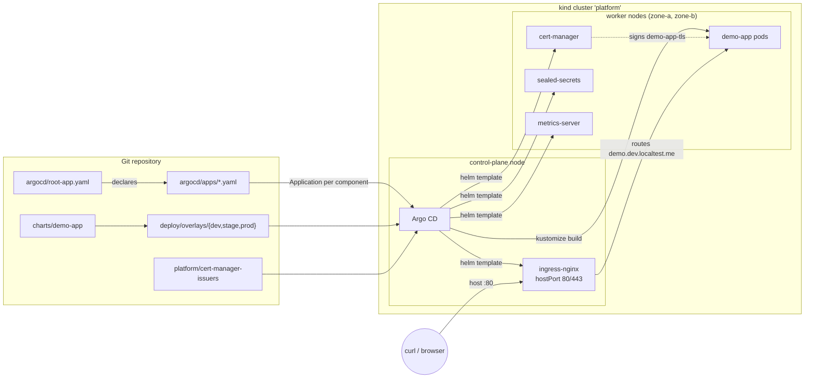
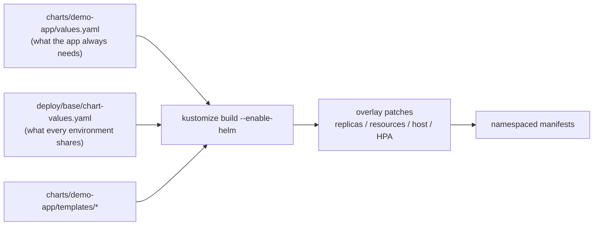

# Architecture

## What runs where

The only imperative step is `kubectl apply -f argocd/root-app.yaml`, performed once
by `scripts/bootstrap.sh`. Everything the root Application finds under
`argocd/apps/` becomes a child Application, and every child pulls its own source:
either an upstream Helm chart at a pinned version, or a path inside this
repository.

## Manifest pipeline for the demo workload

`deploy/base` does not contain a copy of the workload. It inflates the chart that
lives in `charts/demo-app` and the overlays patch that output. A field therefore
exists in exactly one place: either in the chart, because the application always
needs it, or in an overlay, because it differs per environment.

## Node layout

| Node | Role | What it carries |
| --- | --- | --- |
| `platform-control-plane` | control-plane | ingress-nginx (hostPort 80/443), Argo CD, cert-manager |
| `platform-worker` | worker, `zone-a` | demo workload replicas |
| `platform-worker2` | worker, `zone-b` | demo workload replicas |

The two workers carry different `topology.kubernetes.io/zone` labels so that the
`topologySpreadConstraints` in the stage and prod overlays have something real to
spread across. Without them the constraints would render correctly and mean
nothing.

## Component versions

Pinned in the file listed next to each component; nothing tracks `latest`.

| Component | Version | Pinned in |
| --- | --- | --- |
| Argo CD | v3.2.3 | `argocd/install/kustomization.yaml` |
| ingress-nginx | chart 4.14.1 / app 1.14.1 | `argocd/apps/ingress-nginx.yaml` |
| cert-manager | chart and app v1.19.2 | `argocd/apps/cert-manager.yaml` |
| sealed-secrets | chart 2.18.0 / app 0.34.0 | `argocd/apps/sealed-secrets.yaml` |
| metrics-server | chart 3.13.0 / app 0.8.0 | `argocd/apps/metrics-server.yaml` |
| Kubernetes | v1.33.4 (kind node, by digest) | `kind/cluster.yaml` |
| demo-app image | `ealen/echo-server` 0.9.2, by digest | `deploy/base/chart-values.yaml` |
